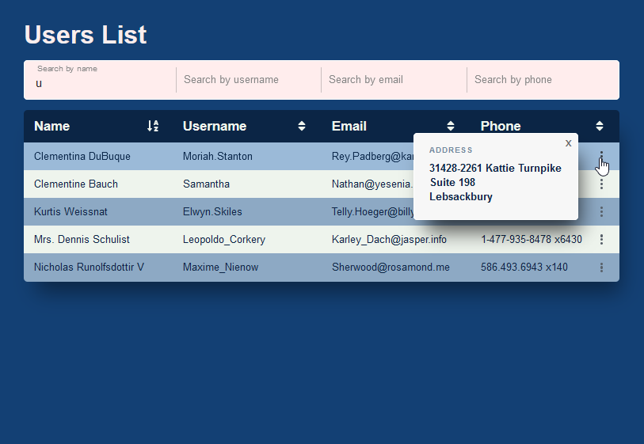

# RTK Users List

A simple application for viewing, searching, and sorting a list of users. Mock data is fetched from a third-party API.

[Links](#links)  
[Features](#features)  
[Setup](#setup)  
[Stack](#stack)  
[Description](#description)

## Screenshot



### Links

- [Live Preview](https://rtk-user-table-hovmvv4eq-seppa89s-projects.vercel.app/)

## Features

- Search  
   Real-time filtering for each column with individual input fields.
- Sort  
   Sort columns alphabetically with easy-to-use options.
- Modal View  
  Display additional user details, such as addresses, in a modal window.

## Setup

**1. Clone the repo**

```
git clone https://github.com/seppa89/RTK-user-table.git
```

**2. Install NPM packages**

```
npm install
```

3. Run project

```
npm run dev
```

## Stack:

- React
- Redux Toolkit
- TypeScript
- CSS Modules

## Description

Store Redux was divided into two parts: users and filters. I wanted a minimalist design that does not overload individual table rows with data. Additional information, such as the address, is available in a modal window.

The key challenge was to use TypeScript effectively to keep the code safe without overly detailed typing.
